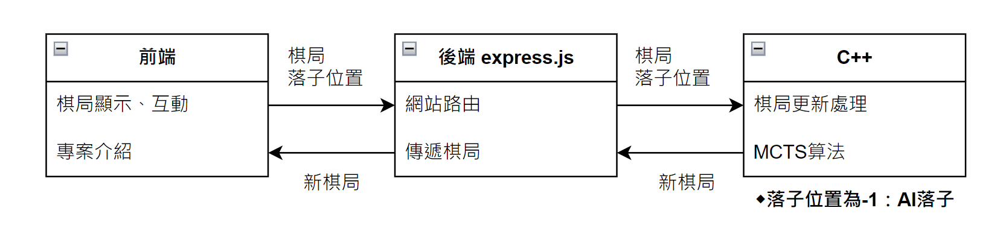

# ♟️ 黑白棋 AI 網頁遊戲

本專案以 **C++**  手刻 **蒙特卡洛樹搜索（MCTS）** 演算法作為黑白棋 AI 核心，並透過 **多執行緒設計** 提升兩倍運算效率，使用 **Express.js** 整合網頁前後端，打造完整的遊戲系統。

---

## ⭐ 功能特色

### **專案介紹**

- **AI輔助**：基於 MCTS 演算法，能逐步搜索與模擬最佳下法  
- **AI vs AI 模式**：可同時開啟AI，觀摩學習 AI 對弈
- **前後端分離架構**：C++ 提供演算效率，前端實作網頁互動介面 
- **影片連結**：https://youtu.be/Fcq8fPVk51s
[](https://youtu.be/Fcq8fPVk51s)

### **多執行緒優化**

- 利用多執行緒縮短2倍AI運算效率，可選擇單執行緒與多執行緒模式，實際體驗優化效果 
- **影片連結**：https://youtu.be/Fcq8fPVk51s
[](https://youtu.be/Fcq8fPVk51s)

---

## 📂 專案架構



```plaintext
OthelloWeb/
├── app.js                # Node.js 伺服器主程式
├── package.json          # 依賴設定
├── README.md             # 專案說明文件
│
├── Cpp/                  # C++ 原始碼與相關檔案 (不影響專案啟動)
│   ├── json.hpp
│   ├── main-origin.cpp
│   ├── main-r01.cpp
│   ├── main-r02.cpp
│   ├── main-r02多執行緒.cpp
│   └── 終端機版/
│       ├── cpp終端機版.cpp
│       ├── cpp終端機版多r02執行緒.cpp
│       └── cpp終端機版r02.cpp
│
├── kernel/               # C++ 核心演算法與編譯檔
│   ├── json.hpp
│   ├── v02-pthread.cpp
│   ├── v02-pthread.exe
│   ├── v02.cpp
│   └── v02.exe
│
├── public/               # 前端靜態資源
│   ├── bootstrap-switch.js
│   ├── function.js
│   ├── prism-cpp.min.js
│   ├── prism.css
│   ├── prism.js
│   ├── file/
│   │   ├── OthelloWeb.pdf
│   │   └── OthelloWeb.pptx
│   └── image/
│       ├── black.png
│       ├── blackLegal.png
│       ├── end.png
│       ├── moveEx.gif
│       ├── start.png
│       ├── step1.png
│       ├── step2.png
│       ├── step3.png
│       ├── step4.png
│       ├── step5.png
│       ├── step6.png
│       ├── structure.png
│       ├── white.png
│       ├── whiteLegal.png
│       └── multiThreadDemo.jpg
│
└── views/                # 前端網頁 (EJS)
    ├── cpp.ejs           # 終端機版一鍵複製
    ├── index.ejs         # 遊戲主畫面
    └── introduce.ejs     # 專案介紹
```

## ⚙️ 安裝與執行

### 前置需求

- C++17 或以上
- Node.js (建議 16+)
- 瀏覽器 Chrome

> ⚠️ 本專案建議於 Windows 系統執行，請安裝 MinGW 或 WSL 以支援 g++ 編譯器。

### 安裝步驟

```bash
# 取得專案
git clone https://github.com/ShyShyFaceElephant/OthelloWeb.git
cd OthelloWeb

# 編譯 C++ 後端（kernel 資料夾）
g++ -o kernel/v02.exe kernel/v02.cpp -O2
g++ -o kernel/v02-pthread.exe kernel/v02-pthread.cpp -O2

# 啟動前端
cd frontend
npm install
npm run serve
```

## 📚 參考資料

- Roy Hung (2019). A Reversi Playing Agent and the Monte Carlo Tree Search Algorithm  (https://royhung.com/reversi)

- David Foster (2017). AlphaGo Zero Explained In One Diagram  
  (https://medium.com/applied-data-science/alphago-zero-explained-in-one-diagram-365f5abf67e0)

