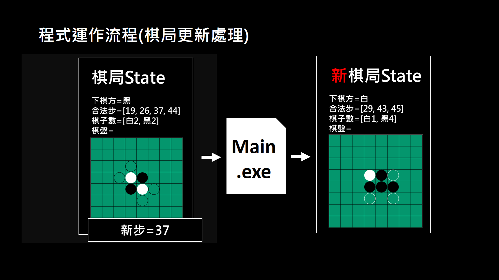
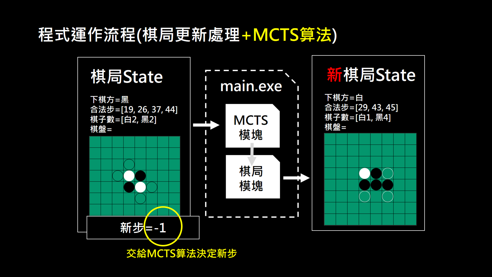
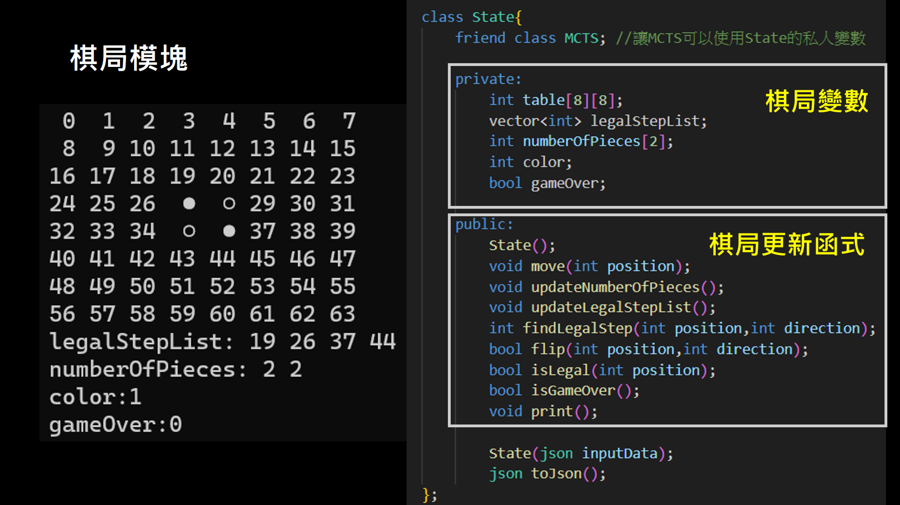
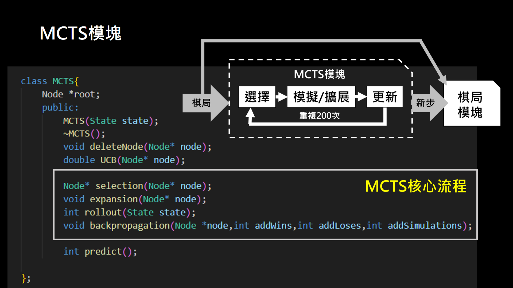
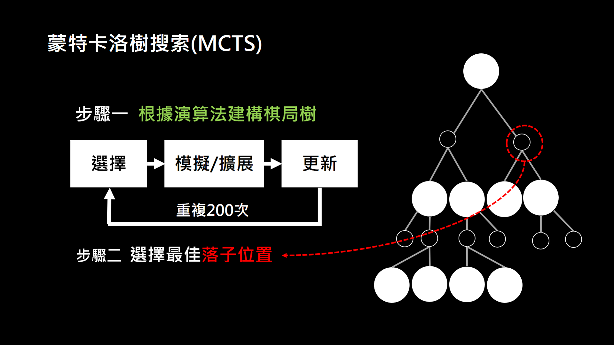
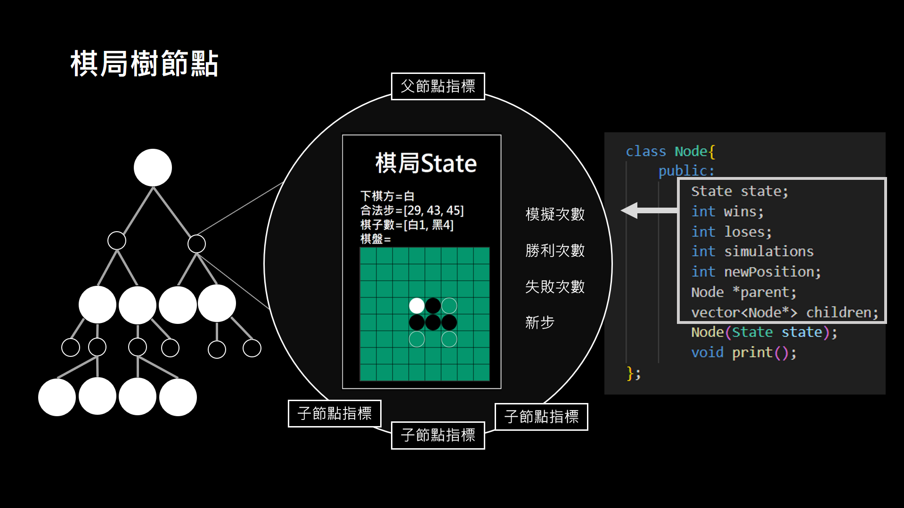
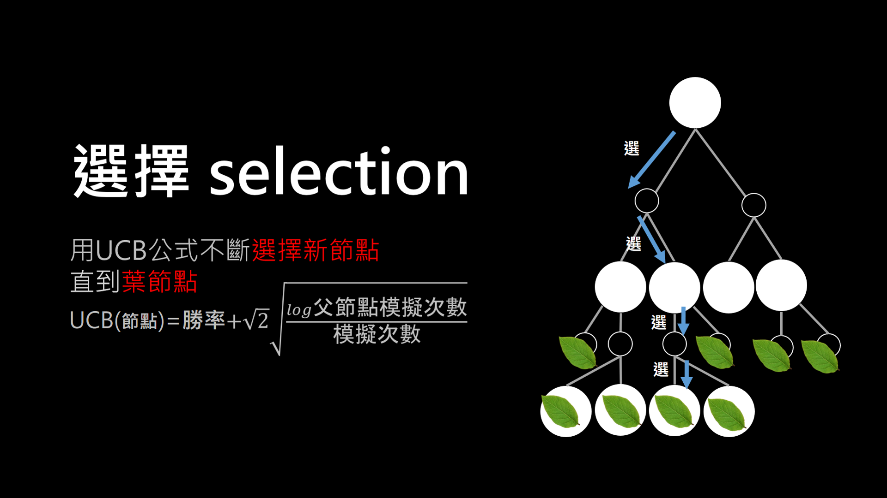
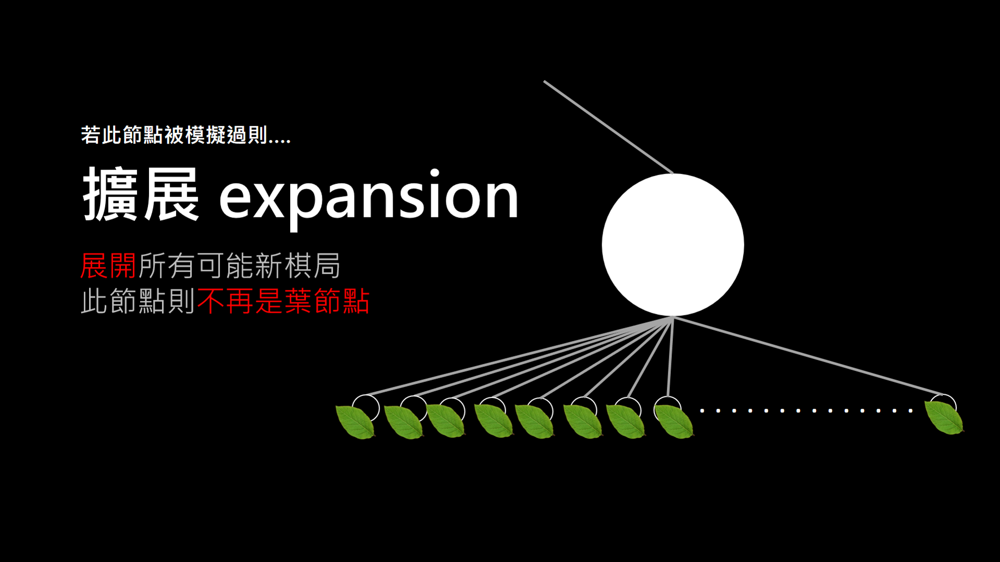
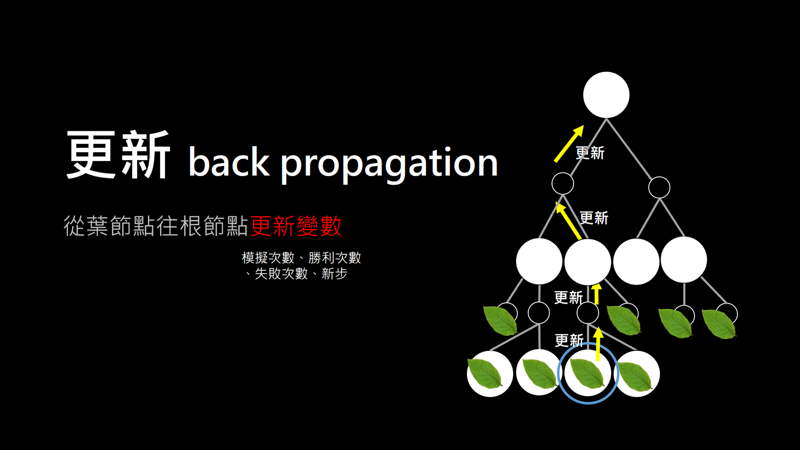

# ♟️ 黑白棋(Ohello/Reversi) AI 網頁遊戲

本專案以 **C++**  手刻 **蒙特卡羅樹搜索（MCTS）** 演算法作為黑白棋 AI 核心，並透過 **多執行緒設計** 提升兩倍運算效率，使用 **Express.js** 整合網頁前後端，打造完整的遊戲系統。

> **🪄補充**：黑白棋遊戲(Ohello)也稱為「反轉棋(Reversi)」，是兩人互下黑白色棋的賽局，目標是在 8×8 共 64 格的棋盤上翻轉對方的棋子，使自己的棋子占據最多位置。

---

## ⭐ 功能特色

### **專案介紹**

- **AI輔助**：基於 MCTS 演算法，能逐步搜索與模擬最佳下法  
- **AI vs AI 模式**：可同時開啟AI，觀摩學習 AI 對弈
- **前後端分離架構**：C++ 提供演算效率，前端實作網頁互動介面 
  
[](https://youtu.be/_fBZeFRpCw8)
**影片連結**：https://youtu.be/_fBZeFRpCw8

### **多執行緒優化**

  利用多執行緒縮短2倍AI運算效率，可選擇單執行緒與多執行緒模式，實際體驗優化效果 

[](https://youtu.be/Fcq8fPVk51s)
**影片連結**：https://youtu.be/Fcq8fPVk51s

---

## 📂 專案架構


```plaintext
OthelloWeb/
├── app.js                # Node.js 伺服器主程式
├── package.json          # 依賴設定
├── README.md             # 專案說明文件
│
├── Cpp/...               # C++ 原始碼與相關檔案 (不影響專案啟動)
│
├── kernel/               # C++ 核心演算法與編譯檔
│   ├── json.hpp
│   ├── v02-pthread.cpp
│   ├── v02-pthread.exe
│   ├── v02.cpp
│   └── v02.exe
│
├── public/               # 前端靜態資源
│   ├── bootstrap-switch.js
│   ├── function.js
│   ├── prism-cpp.min.js
│   ├── prism.css
│   ├── prism.js
│   ├── file/
│   │   ├── OthelloWeb.pdf
│   │   └── OthelloWeb.pptx
│   └── image/...
│
└── views/                # 前端網頁 (EJS)
    ├── cpp.ejs           # 終端機版一鍵複製
    ├── index.ejs         # 遊戲主畫面
    └── introduce.ejs     # 專案介紹
```

---

## 🪡 單執行緒 vs. 多執行緒 實驗概要

**實驗方法**：固定選代次數，實測不同模擬次數下，平均一步的運算時間（與自己對弈）。

**迭代次數**：200

**CPU規格**：Intel® Core™ i5-1135G7

**實驗數據**：

| 模擬次數 | 單執行緒 (ms) | 多執行緒 (ms) | 比值 |
|----------|-----------------------------|-----------------------------|------|
| 30       | 878                         | 436                         | 2.0  |
| 40       | 1639                        | 577                         | 2.8  |
| 50       | 1265                        | 709                         | 1.8  |
| 60       | 2267                        | 837                         | 2.7  |
| 70       | 1701                        | 988                         | 1.7  |

---

## 🏃‍♀️‍➡️程式運作流程






---

## 🌲 蒙特卡羅樹搜索

蒙特卡羅樹搜索是一種基於機率模擬的啟發式搜索演算法，特別適用於博奕遊戲的決策優化。其核心思想是藉由隨機模擬來評估潛在落子位置的價值，逐步建構搜尋樹以逼近最佳決策。西元2018年後，基於蒙特卡洛樹搜索與強化學習的架構「AlphaZero」主宰棋類遊戲，人類在該領域已經沒辦法戰勝人工智慧。




蒙特卡洛樹搜索每次迭代包含四個階段：

1. **選擇 (Selection)**：從根結點出發，根據勝率與探索次數選擇子節點，直到葉節點。

  

2. **擴展 (Expansion)**：展開所有新節點，此節點不再是葉節點。

  

3. **模擬 (Rollout)**：從此節點開始隨機落子直到遊戲結束並紀錄勝負，此過程將重複數次。

  

4. **反向更新 (Backpropagation)**：反向傳播新勝率與探索次數，更新父節點統計數據。



---

## 💔 Othello 名稱由來（紀光輝教授另註）

這套黑白棋遊戲原名 Othello (奧賽羅)，源於莎士比亞戲劇中的一位悲劇人物；奧賽羅是英勇的黑人將軍，愛妻是白人，因受小人挑撥，懷疑妻子不忠而情海怒濤翻騰，最終親手殺死妻子。後來真相大白，奧賽羅悔恨不已，亦自殺而死。故事以威尼斯與塞普勒斯(Cyprus)為背景，講述一位負責防衛鄂圖曼土耳其帝國軍隊入侵的奧賽羅將軍與新婚妻子 Desdemona 之間的複雜愛情糾葛。年輕貌美的愛妻是威尼斯富商之女，不顧父親反對而執意嫁給條件不夠優渥的奧賽羅。奧賽羅在軍中表現出色，但他的麾下 Iago 升遷不順、怨妒及其他闇黑原因而不懷好心，企圖破壞這一對恩愛夫妻。Iago 利用奧賽羅對自己的信任，操縱他的想法，令他相信其妻與一名受提拔的年輕軍官卡西歐(Cassio)有染，並且利用奧賽羅對自己黑皮膚的偏見加深誤會。惡意的詭計使得奧賽羅的猜忌和嫉妒達到頂點，引發他對妻子的懷疑與憤怒，最終導致悲劇的結局。

---

## ⚙️ 安裝與執行

### 前置需求

- C++17 或以上
- Node.js (建議 16+)
- 瀏覽器 Chrome

> ⚠️ 本專案建議於 Windows 系統執行，請安裝 MinGW 或 WSL 以支援 g++ 編譯器，且須可以編譯 **phread.h** 函式庫。

### 安裝步驟

```bash
# 取得專案
git clone https://github.com/ShyShyFaceElephant/OthelloWeb.git
cd OthelloWeb

# 編譯 C++ 後端（kernel 資料夾）
g++ -o kernel/v02.exe kernel/v02.cpp -O2
g++ -o kernel/v02-pthread.exe kernel/v02-pthread.cpp -O2

# 安裝 Node.js 依賴並啟動伺服器
npm install
node app.js

# 網站將發布在 http://localhost:8080/
```

---

## 📚 參考資料

- Roy Hung (2019). A Reversi Playing Agent and the Monte Carlo Tree Search Algorithm  (https://royhung.com/reversi)

- David Foster (2017). AlphaGo Zero Explained In One Diagram  
  (https://medium.com/applied-data-science/alphago-zero-explained-in-one-diagram-365f5abf67e0)